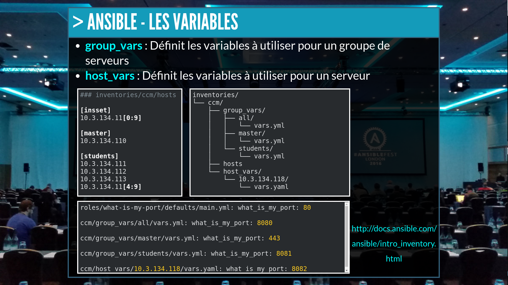

# devops-360-variables
DevOps 360° Variables is an exercise to help you understand how group_vars and host_vars land with Ansible. For more details about the project, please check: http://slides.com/floriandambrine/devops360

### Exercise

>What's the value of `what_is_my_port` if I run the automation with the inventory `localhost` ?

---

>What's the value of `what_is_my_port` if I run the automation with the inventory `ccm` on `master` ?

---

>What's the value of `what_is_my_port` if I run the automation with the inventory `ccm` on `master` ?

---

>What's the value of `what_is_my_port` if I run the automation with the inventory `ccm` on `students` ?

---

>What's the value of `what_is_my_port` if I run the automation with the inventory `ccm` on `all servers` with the ansible option `--extra-vars what_is_my_port=8888` ?
